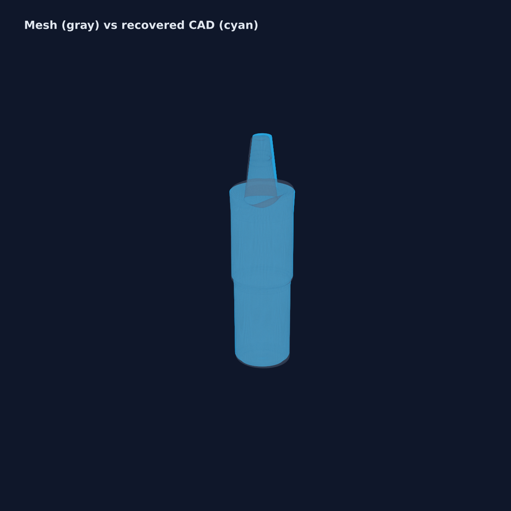
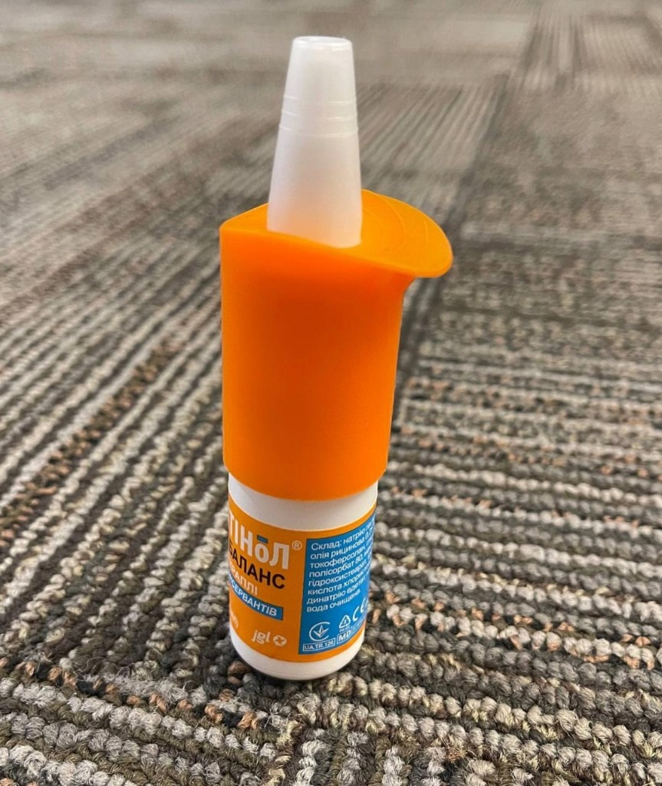
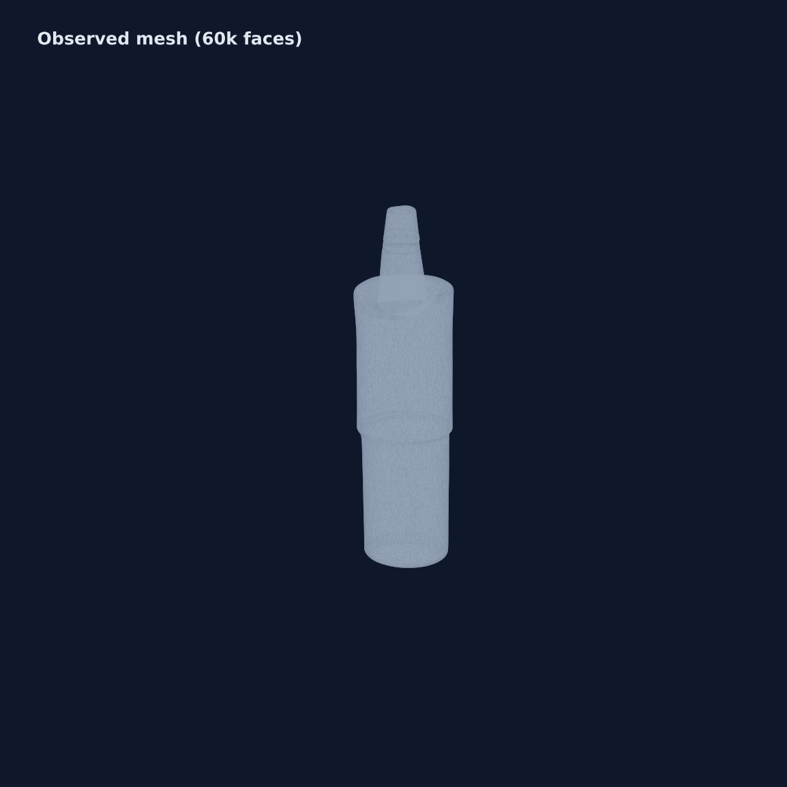
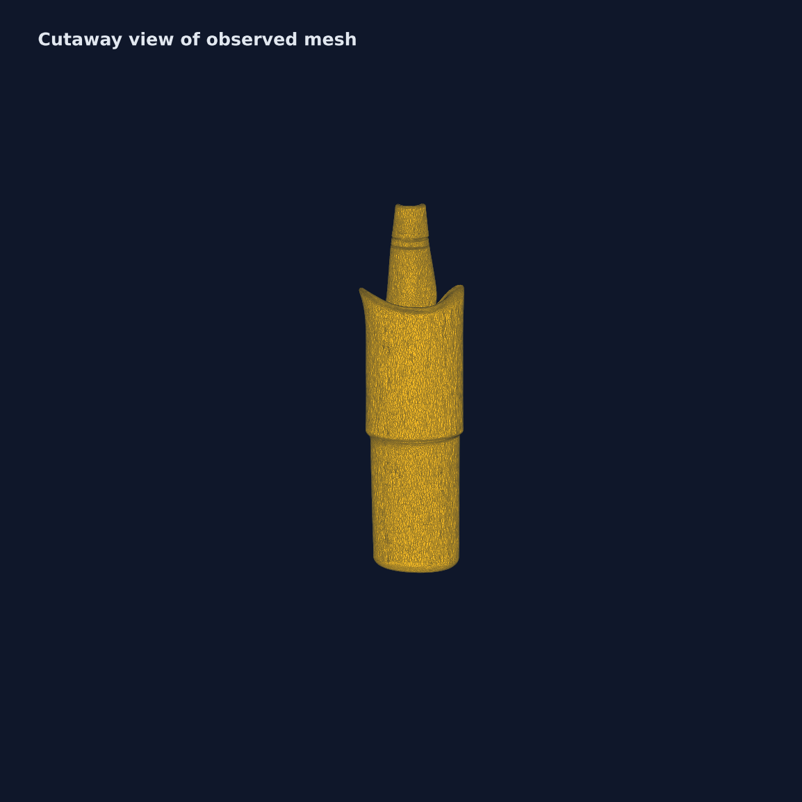
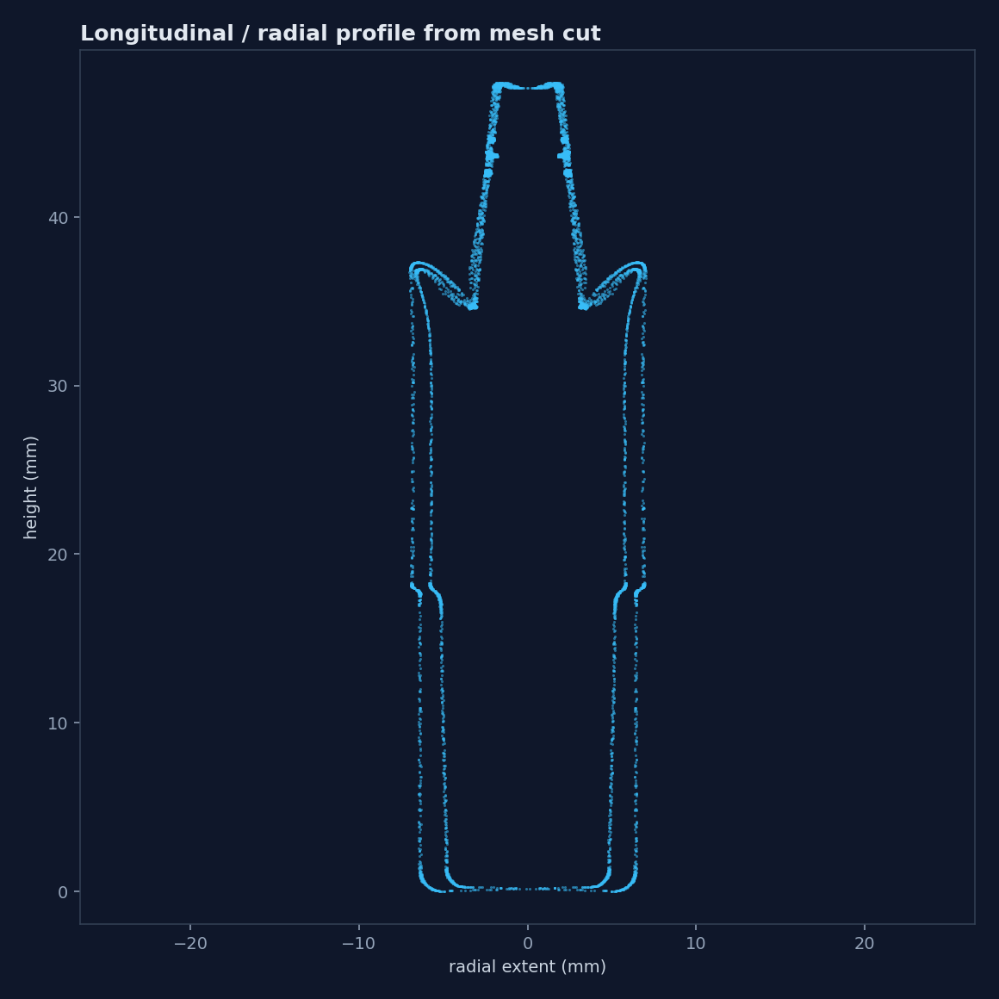
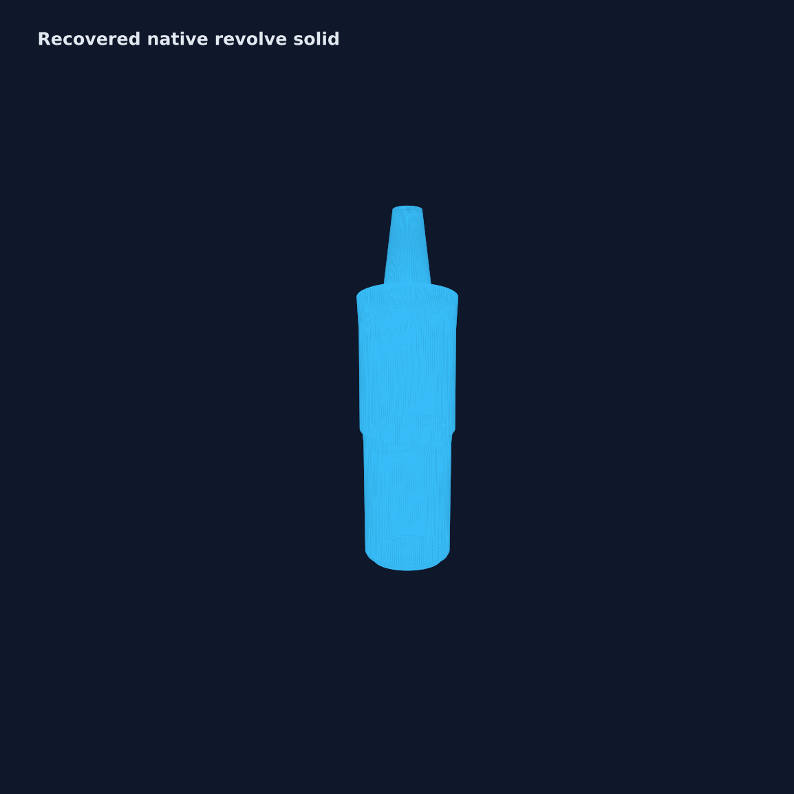

# CAD-View

**Photos and meshes in. Editable SolidWorks feature trees out — with honesty about what was measured vs inferred.**

CAD-View is a local reverse-engineering pipeline: qualify scanned or reconstructed geometry, recover parametric features when the evidence supports it, and export a native SolidWorks history instead of a dumb solid.

[](demo/nasal-spray-base/cadview-nasal-spray-demo.mp4)

*Click the image to open the nasal-spray demo video (`demo/nasal-spray-base/cadview-nasal-spray-demo.mp4`), or browse the [gallery](demo/nasal-spray-base/gallery/).*

## Demo: nasal spray bottle

Physical part → observed mesh → scored revolve → editable feature tree.

| Step | Preview |
| --- | --- |
| Physical bottle |  |
| Observed mesh |  |
| Mesh cutaway |  |
| Radial profile cut |  |
| Recovered revolve |  |
| Mesh vs CAD overlay |  |

**Result on this part:** native revolve about the long axis, volume error ≈ **1.8%**, IoU ≈ **0.906**, 13-point profile sketch. The previous default extrude path was ≈ **47.6%** volume error on the same mesh.

Assets live under [`demo/nasal-spray-base/`](demo/nasal-spray-base/):

- `input-photo.png` / `gallery-bottle-photo.jpg` — capture reference
- `reconstruction-60k.stl` — observed mesh used in the demo
- `recovered-revolve.stl` — solid recovered from the winning revolve
- `parametric-revolve.vbs` — builds Sketch + Revolve1 in SolidWorks
- `cadview-nasal-spray-demo.mp4` — ~25s gallery walkthrough
- `make_gallery.py` — regenerates renders + video

## What it does

1. **Capture → observed mesh** — Meshroom/AliceVision photogrammetry, with VGGT + masked TSDF fusion as a neural rescue path. Human-reviewed SAM masks keep background out of densification.
2. **Qualify the mesh** — Immutable source bytes + SHA-256 provenance, watertightness / winding / components / Euler diagnostics, physical scale from a two-point constraint, and check dimensions with pass/fail tolerances.
3. **Recover editable CAD** — Competing hypotheses (extrude vs revolve about principal axes, cam-style sweep cuts, residual bosses/cuts/radial holes, revolved cuts) are scored against the mesh, then compiled through a typed .NET SolidWorks bridge (VBScript fallback for simpler ops).
4. **Export with receipts** — Qualified meshes, STEP (analytic or faceted), SolidWorks scripts/parts, and machine-readable quality reports.

## Pipeline

```text
Photos / Video / STL / OBJ / PLY
                |
                v
     Immutable source + provenance
                |
        +-------+--------+
        |                |
        v                v
Topology diagnostics   Scale anchor
        |                |
        +-------+--------+
                v
      Independent check dimensions
                |
                v
      Conservative topology repair
                |
        +-------+---------+
        |                 |
        v                 v
   Parametric search    Quality report
   (extrude / revolve /
    residual features)
                |
                v
     Native SolidWorks .SLDPRT
     (editable feature tree)
```

## Implemented

- Immutable STL, OBJ, and PLY ingestion with SHA-256 provenance.
- Browser-based Three.js inspection and surface point selection.
- Watertightness, winding, connected components, Euler number, bounds, extents, and conditional volume diagnostics.
- Non-destructive uniform scaling from a two-point physical constraint.
- Independent check dimensions with expected value, tolerance, signed residual, relative error, and pass/fail status.
- Conservative repair derivatives (duplicate-face removal, winding correction, optional hole filling with human review).
- Local photo-set and video reconstruction (Meshroom + VGGT rescue).
- Human-reviewed SAM 2.1 foreground masks for photogrammetry.
- Analytic box/cylinder fitting and faceted/analytic STEP export (CadQuery / OpenCascade).
- Prismatic feature recovery, native revolve recovery, residual multi-feature search (bosses, cuts, radial holes, revolved cuts), and cam-style sweep cuts.
- Native SolidWorks `.SLDPRT` generation through a strongly typed .NET bridge.

Photo/video meshes are labeled `photogrammetry / unscaled` and must receive a physical scale constraint before dimensional checks can be recorded.

## Development

### Geometry API

```powershell
cd backend
python -m venv .venv
.\.venv\Scripts\Activate.ps1
pip install -e ".[dev,vision]"
uvicorn main:app --reload
```

API: `http://127.0.0.1:8000` · OpenAPI: `http://127.0.0.1:8000/docs`

### Web application

```powershell
cd frontend
npm install
npm run dev
```

App: `http://localhost:5173` (proxies `/api` to FastAPI).

### Editable SolidWorks export

Requires a licensed SolidWorks install, COM API registration, and .NET 9. If the API process cannot drive SolidWorks directly, CAD-View returns an interactive `.vbs` builder (for example `parametric-revolve.vbs`).

### Regenerate demo media

```powershell
backend\.venv\Scripts\python.exe demo\nasal-spray-base\make_gallery.py
```

### Meshroom

Set `$env:MESHROOM_BATCH_PATH` or place Meshroom under `tools/`. Runs locally; dense processing benefits from a CUDA NVIDIA GPU.

## Current trust boundaries

- Uploaded source bytes are never overwritten.
- Scaling and repair always create derived artifacts with parent lineage.
- Hole filling is opt-in and flagged for review.
- Photogrammetry is reconstructed evidence, not metrology validation.
- Global volume IoU can still miss shallow grooves / thin radial holes; local residual scoring and broader feature vocabulary are active work.
- Native SolidWorks history requires SolidWorks automation. STEP remains a dumb B-Rep/faceted body and cannot carry a SolidWorks feature tree.

## Project story

See [`HACKATHON.md`](HACKATHON.md) for inspiration, build notes, challenges, and roadmap. Research tracking lives in [`research/PAPER_LEDGER.md`](research/PAPER_LEDGER.md).
